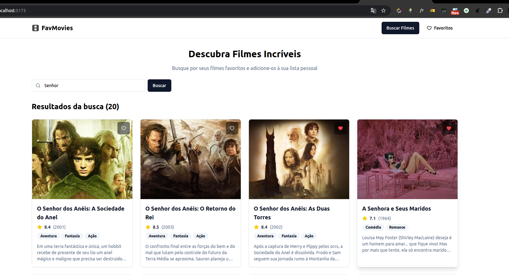

# Fav movies


Esta é uma aplicação de catálogo de filmes que permite buscar filmes na API do The Movie Database (TMDB) e gerenciar uma lista local de favoritos.

## Tecnologias Utilizadas

  * **Backend**: Laravel 10
  * **Frontend**: React 18 com TypeScript,Vite e React Query (TanStack Query)
  * **Banco de Dados**: MySQL 8.0
  * **Estilização**: Tailwind CSS com shadcn/ui
  * **Ambiente de Desenvolvimento**: Docker e Docker Compose


## Como rodar o projeto localmente com Docker

O ambiente da aplicação é 100% containerizado com Docker, garantindo que o setup seja simples e rápido, com um único comando.
Clonar em diretórios de sistema como /var/www/ pode causar erros de permissão do Docker.

### Pré-requisitos

  * [Docker](https://www.docker.com/get-started)
  * [Docker Compose](https://docs.docker.com/compose/install/)

### Passo a Passo

1.  **Clone o repositório:**

    ```bash
    git clone https://github.com/laurielylourenco/favmovies.git
    cd favmovies
    ```

2.  **Configure o Ambiente do Backend:**
    O backend precisa de uma chave de API para se comunicar com o The Movie Database (TMDB).

      * Copie o arquivo de exemplo `.env.example` para um novo arquivo chamado `.env`:
        ```bash
        cp backend/.env.example backend/.env
        ```
      * Edite o arquivo `backend/.env` e adicione sua chave da API do TMDB na variável `TMDB_API_KEY`.

3.  **Inicie a Aplicação:**
    Use o Docker Compose para construir as imagens e iniciar todos os contêineres em segundo plano.

    ```bash
    sudo docker-compose up -d --build
    ```

    Este único comando fará tudo automaticamente:

      * Instalará as dependências do Composer para o backend.
      * Executará as migrações do banco de dados (`php artisan migrate`).
      * Instalará as dependências do NPM para o frontend.
      * Iniciará os servidores do backend e do frontend.

4.  **Acesse a Aplicação:**
    Após os contêineres iniciarem, a aplicação estará disponível nos seguintes endereços:

      * **Frontend (Interface do Usuário):** [**http://localhost:5173**](https://www.google.com/search?q=http://localhost:5173)
      * **Backend (API):** `http://localhost:8000`

## Como importar o banco de dados

**Nenhuma ação é necessária.**

O ambiente Docker foi configurado para executar as migrações do Laravel (`php artisan migrate`) automaticamente toda vez que o contêiner do backend é iniciado. Isso cria todas as tabelas e a estrutura do banco de dados do zero, garantindo um ambiente limpo e pronto para uso.


## Indicação de onde está implementado o CRUD

A lógica de CRUD (Create, Read, Update, Delete) para os filmes favoritos está implementada no backend (Laravel). Os arquivos principais são:

  * **Rotas da API:** As definições de todos os endpoints (`/api/favorites`, `/api/movies/search`, etc.) estão em:
      * `backend/routes/api.php`
  * **Controller:** O controller que contém toda a lógica de negócio (adicionar, remover, listar e filtrar favoritos) é o:
      * `backend/app/Http/Controllers/Api/MovieController.php`
  * **Models:** Os models do Eloquent que representam as tabelas do banco de dados são:
      * `backend/app/Models/FavoriteMovie.php`
      * `backend/app/Models/Genre.php`


## API Endpoints

  * `GET /api/movies/search?query={nome_do_filme}`: Busca filmes no TMDB.
  * `GET /api/favorites`: Lista os filmes favoritados.
  * `POST /api/favorites`: Adiciona um filme aos favoritos.
  * `DELETE /api/favorites/{tmdb_id}`: Remove um filme dos favoritos.


## Instruções sobre como testar a aplicação

A aplicação pode ser testada manualmente através da interface do usuário no navegador.

1.  **Acesse o Frontend:** Abra [**http://localhost:5173**](https://www.google.com/search?q=http://localhost:5173) no seu navegador.
2.  **Visualizar Filmes:** A página inicial exibirá uma lista de "Filmes em Destaque" carregados automaticamente.
3.  **Buscar Filmes:** Utilize a barra de busca no topo da página para procurar por um filme específico pelo nome (ex: "Matrix").
4.  **Adicionar um Favorito:** Em qualquer card de filme, clique no ícone de coração (♡). A ação será confirmada por uma notificação e o ícone ficará preenchido (❤️).
5.  **Visualizar Favoritos:** Clique no botão "Favoritos" no cabeçalho. A página de favoritos exibirá todos os filmes que você adicionou.
6.  **Filtrar Favoritos:** Na página de favoritos, use o seletor "Filtrar por gênero" para visualizar apenas os filmes de um gênero específico.
7.  **Remover um Favorito:** Tanto na página de busca quanto na de favoritos, clique no ícone de coração preenchido (❤️) de um filme já favoritado para removê-lo da sua lista.
8. **Filmes sem gênero**: Filmes retornados pela API que não possuem gêneros definidos não podem ser adicionados à lista de favoritos.

## Link para obter a chave da API do TMDB

Para utilizar a funcionalidade de busca, é obrigatório ter uma chave de API do **The Movie Database (TMDB)**.

  * **Link para o site:** [https://www.themoviedb.org/](https://www.themoviedb.org/)
  * **Instruções para obter a chave:**
    1.  Crie uma conta gratuita no site.
    2.  Acesse as configurações da sua conta (`Settings/Configurações`).
    3.  No menu lateral, clique na seção `API`.
    4.  Crie uma nova chave de API (pode ser necessário preencher um breve formulário sobre o uso).
    5.  Copie a sua "Chave da API" e cole no arquivo `backend/.env`.
